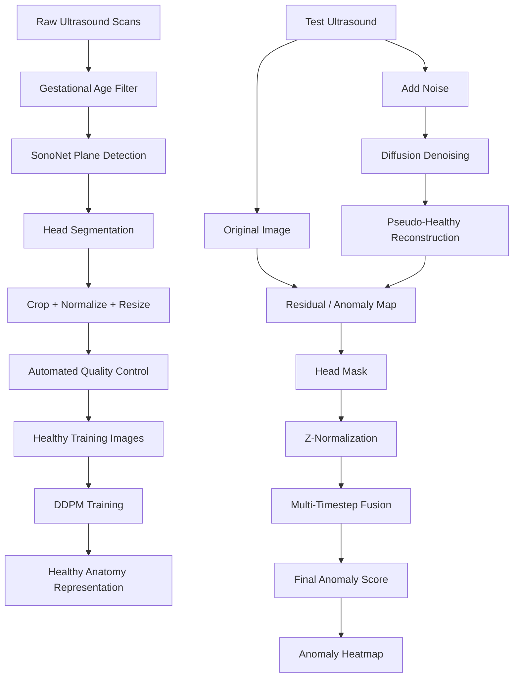

# 🧠 FetalBrain-UAD+

### Unsupervised Anomaly Detection in Fetal Brain Ultrasound Using Diffusion Models

<p align="center">

**A research-oriented extension of diffusion-based anomaly detection for mid-pregnancy fetal brain ultrasound images.**

</p>

<p align="center">


</p>

> ⚠️ **Research Use Only:** This project is **not a medical device** and is not validated for diagnosis, screening, or clinical decision-making.

---

## 🌟 Overview

Fetal brain abnormalities are challenging to detect using supervised deep-learning models because pathological conditions are **rare, diverse, and difficult to collect in large quantities**.

**FetalBrain-UAD+** explores an unsupervised approach using **denoising diffusion probabilistic models (DDPMs)** trained primarily on healthy fetal brain ultrasound images.

During inference:

1. A fetal brain ultrasound image is partially noised.
2. The diffusion model denoises the image toward a learned representation of normal anatomy.
3. The original image is compared with the reconstructed image.
4. Differences are converted into an **anomaly map**.
5. The anomaly map is aggregated into an image-level anomaly score.

The project extends the methodology introduced by **Mykula et al. (2024)** with improved preprocessing, scoring, inference, quality control, and evaluation.

---

## 🎯 Project Goal

> **Learn what healthy fetal brain ultrasound looks like and identify regions that deviate from the learned normal anatomy.**

This approach is particularly interesting when abnormal examples are scarce.

---

# 🔬 How It Works



---

# 🚀 What Makes FetalBrain-UAD+ Different?

| #     | Improvement                        | Purpose                                                 |
| ----- | ---------------------------------- | ------------------------------------------------------- |
| 🕐 1  | **Multi-timestep ensemble**        | Reduces sensitivity to a single diffusion timestep      |
| 🧠 2  | **Head-mask restriction**          | Reduces false positives from skull edges and background |
| 📊 3  | **Healthy-normalized residuals**   | Accounts for naturally variable anatomy                 |
| 👁️ 4 | **SonoNet perceptual features**    | Adds ultrasound-aware feature comparison                |
| ↔️ 5  | **Bilateral asymmetry**            | Uses brain symmetry as an additional anomaly cue        |
| 🌫️ 6 | **Speckle-aware noise**            | Better reflects ultrasound image characteristics        |
| ⚡ 7   | **EMA + cosine schedule + AMP**    | Improves training stability and efficiency              |
| 🤖 8  | **Automated QA filtering**         | Reduces poor-quality images before inference            |
| 📈 9  | **Patient-level cross-validation** | Provides more reliable evaluation                       |
| ⚡ 10  | **DDIM sampling**                  | Provides a faster inference option                      |

---

# 🧩 Complete Pipeline

```text
                  ┌───────────────────────┐
                  │   Raw Ultrasound      │
                  │        Scans          │
                  └───────────┬───────────┘
                              │
                              ▼
                  ┌───────────────────────┐
                  │ Gestational Age       │
                  │ Filter: 19+0–22+6     │
                  └───────────┬───────────┘
                              │
                              ▼
                  ┌───────────────────────┐
                  │ SonoNet-32            │
                  │ Brain (TV.) ≥ 0.90    │
                  └───────────┬───────────┘
                              │
                              ▼
                  ┌───────────────────────┐
                  │ Head Segmentation     │
                  │ Crop + Normalization  │
                  └───────────┬───────────┘
                              │
                              ▼
                  ┌───────────────────────┐
                  │ Automated QA Filter   │
                  └───────────┬───────────┘
                              │
                              ▼
             ┌────────────────────────────────┐
             │       Healthy Images Only      │
             └───────────────┬────────────────┘
                             │
                             ▼
                  ┌───────────────────────┐
                  │      DDPM Training    │
                  │ EMA + Cosine + AMP    │
                  └───────────┬───────────┘
                              │
                    ┌─────────┴─────────┐
                    ▼                   ▼
             Test Ultrasound       Diffusion Model
                    │                   │
                    └─────────┬─────────┘
                              ▼
                    Pseudo-Healthy Image
                              │
                              ▼
                     Residual Comparison
                              │
                              ▼
                ┌─────────────────────────┐
                │ MAE × LPIPS             │
                │ SonoNet Features        │
                │ Bilateral Asymmetry     │
                │ Z-Normalization         │
                └────────────┬────────────┘
                             │
                             ▼
                   Anomaly Heatmap + Score
```

---

# 📊 Baseline Results

Results reported in the original study for **18 pathological + 12 healthy images**:

| Method                     |    AUPRC | AUROC |
| -------------------------- | -------: | ----: |
| AnoDDPM — Gaussian, t=250  |     73.0 |  63.8 |
| AnoDDPM — Gaussian, t=300  |     73.5 |  57.4 |
| AnoDDPM — Simplex, t=50    |     78.9 |  70.8 |
| AutoDDPM — Gaussian, t=300 | **79.8** |  66.6 |

### 🧪 FetalBrain-UAD+ Results

Patient-level **5-fold cross-validation**:

| Method                           |   AUPRC |   AUROC |
| -------------------------------- | ------: | ------: |
| Re-implemented AutoDDPM baseline |   `TBD` |   `TBD` |
| + Head mask + Z-normalization    |   `TBD` |   `TBD` |
| + Multi-timestep ensemble        |   `TBD` |   `TBD` |
| + SonoNet feature distance       |   `TBD` |   `TBD` |
| **Full FetalBrain-UAD+ model**   | **TBD** | **TBD** |

> Results will be updated as experiments are completed.

---

# 🏗️ Project Architecture

```text
FetalBrain-UAD-Plus/
│
├── 📁 configs/
│   ├── preprocess.yaml
│   ├── ddpm.yaml
│   └── infer.yaml
│
├── 📁 data/
│   ├── processed/
│   │   ├── healthy/
│   │   ├── test_healthy/
│   │   └── test_pathology/
│   │
│   └── splits/
│       └── patient_folds.json
│
├── 📁 src/
│   ├── preprocessing/
│   │   ├── age_filter.py
│   │   ├── sononet_gate.py
│   │   ├── segmentation.py
│   │   └── qa.py
│   │
│   ├── models/
│   │   ├── ddpm.py
│   │   ├── unet.py
│   │   ├── ema.py
│   │   └── schedules.py
│   │
│   ├── inference/
│   │   ├── anod dpm.py
│   │   ├── autoddpm.py
│   │   ├── ddim.py
│   │   └── ensemble.py
│   │
│   ├── scoring/
│   │   ├── mae.py
│   │   ├── lpips.py
│   │   ├── sononet_features.py
│   │   ├── asymmetry.py
│   │   └── normalization.py
│   │
│   └── evaluation/
│       ├── metrics.py
│       ├── bootstrap.py
│       └── cross_validation.py
│
├── 📁 scripts/
│   ├── preprocess.py
│   ├── qa_filter.py
│   ├── make_splits.py
│   ├── train.py
│   ├── calibrate.py
│   ├── infer.py
│   └── evaluate.py
│
├── 📁 notebooks/
├── 📁 tests/
│
├── 📄 requirements.txt
├── 📄 LICENSE
└── 📄 README.md
```

---

# 🛠️ Technology Stack

| Category           | Technologies                    |
| ------------------ | ------------------------------- |
| Programming        | Python 3.9+                     |
| Deep Learning      | PyTorch                         |
| Medical AI         | MONAI                           |
| Diffusion          | DDPM / DDIM                     |
| Image Processing   | OpenCV, SimpleITK, scikit-image |
| Evaluation         | scikit-learn                    |
| Perceptual Metrics | LPIPS                           |
| Configuration      | YAML                            |
| Visualization      | Matplotlib                      |
| Quality Control    | SonoNet                         |

---

# 💻 Installation

## 1. Clone the repository

```bash
git clone https://github.com/<your-username>/FetalBrain-UAD-Plus.git
cd FetalBrain-UAD-Plus
```

## 2. Create a virtual environment

### Windows

```bash
python -m venv .venv
.venv\Scripts\activate
```

### Linux / macOS

```bash
python -m venv .venv
source .venv/bin/activate
```

## 3. Install dependencies

```bash
pip install -r requirements.txt
```

---

# 📦 Dataset

### Private Clinical Dataset

The clinical dataset used for research contains **234 control patients** and is not included in this repository.

Patient data must never be committed to GitHub.

### Public Dataset

The project can also make use of:

**FETAL_PLANES_DB**

https://doi.org/10.5281/zenodo.3904280

Always review the dataset license and metadata availability before using or redistributing the data.

### Expected Data Structure

```text
data/
│
├── processed/
│   ├── healthy/
│   ├── test_healthy/
│   └── test_pathology/
│
└── splits/
    └── patient-level-folds.json
```

> ⚠️ **Important:** Dataset splitting must always happen at the **patient level**, never at the image level. This prevents data leakage between training and testing.

---

# ▶️ Usage

## 1. Preprocess the ultrasound images

```bash
python scripts/preprocess.py \
    --config configs/preprocess.yaml
```

This performs:

* Gestational-age filtering
* SonoNet plane detection
* Head segmentation
* Cropping
* Normalization
* Resizing

---

## 2. Run automated quality control

```bash
python scripts/qa_filter.py \
    --config configs/preprocess.yaml
```

Suspicious images can then be reviewed manually.

---

## 3. Create patient-level folds

```bash
python scripts/make_splits.py \
    --k 5 \
    --seed 42
```

---

## 4. Train the DDPM

```bash
python scripts/train.py \
    --config configs/ddpm.yaml \
    --fold 0
```

---

## 5. Calibrate healthy residual statistics

```bash
python scripts/calibrate.py \
    --config configs/ddpm.yaml \
    --fold 0
```

---

## 6. Run inference

```bash
python scripts/infer.py \
    --config configs/infer.yaml \
    --fold 0 \
    --method autoddpm \
    --t 100 200 300
```

---

## 7. Evaluate the model

```bash
python scripts/evaluate.py \
    --config configs/infer.yaml \
    --all-folds
```

---

# ⚙️ Example Configuration

```yaml
image_size: 128

timesteps: 1000

noise_schedule: cosine

lr: 1.0e-4

batch_size: 16

ema_decay: 0.999

mixed_precision: true

augment:
  - flip
  - small_affine
  - intensity_jitter
```

---

# 📈 Evaluation Strategy

The project uses a rigorous evaluation protocol:

### Cross-validation

* Patient-level **5-fold cross-validation**
* Healthy images used for training
* Pathological cases kept strictly for testing

### Image-level metrics

* AUROC
* AUPRC

### Reconstruction metrics

* MAE
* LPIPS
* SSIM

### Pixel-level metrics

When lesion masks are available:

* Pixel-level AUPRC
* Dice score
* Best operating threshold

### Statistical analysis

Results are reported with:

> **95% bootstrap confidence intervals**

---

# 🧪 Ablation Study

The model will be evaluated incrementally:

```text
Baseline
   │
   ├── + Head Mask
   │
   ├── + Z-Normalization
   │
   ├── + Multi-Timestep Ensemble
   │
   ├── + SonoNet Feature Distance
   │
   ├── + Bilateral Asymmetry
   │
   └── Full FetalBrain-UAD+
```

This makes it possible to determine which improvements actually contribute to anomaly-detection performance.

---

# 📌 Limitations

Despite the improvements, several limitations remain:

* Small dataset size
* 2D static ultrasound planes
* Limited representation of pathological conditions
* Single-site clinical data
* Scanner/domain generalization remains untested
* No temporal or 3D information
* Anomaly maps may highlight benign anatomical variation
* Ultrasound artefacts may also appear as anomalies

---

# 🗺️ Roadmap

* [ ] 🔄 Reproduce AnoDDPM baseline
* [ ] 🔄 Reproduce AutoDDPM baseline
* [ ] ⬜ Implement head-mask scoring
* [ ] ⬜ Implement healthy z-normalization
* [ ] ⬜ Implement multi-timestep ensemble
* [ ] ⬜ Add SonoNet feature distance
* [ ] ⬜ Add bilateral asymmetry
* [ ] ⬜ Validate automated QA
* [ ] ⬜ Complete ablation experiments
* [ ] ⬜ Add bootstrap confidence intervals
* [ ] ⬜ Investigate temporal ultrasound-sweep scoring
* [ ] ⬜ Evaluate multi-scanner generalization

---

# 🔐 Ethics & Responsible Use

This repository is intended **for research purposes only**.

The model:

* ❌ Is not a medical device
* ❌ Is not approved for clinical diagnosis
* ❌ Should not be used for patient management
* ❌ Should not replace expert clinical interpretation

Clinical data must be handled according to applicable:

* Ethical approval requirements
* Institutional policies
* Data-protection regulations
* Dataset licenses

**Never commit patient-identifiable information or clinical images to this repository.**

---

# 📚 References

### Mykula et al. — 2024

> *Diffusion Models for Unsupervised Anomaly Detection in Fetal Brain Ultrasound*

arXiv:2407.15119

```bibtex
@article{mykula2024diffusion,
  title   = {Diffusion Models for Unsupervised Anomaly Detection in Fetal Brain Ultrasound},
  author  = {Mykula, Hanna and Gasser, Lisa and Lobmaier, Silvia and Schnabel, Julia A. and Zimmer, Veronika and Bercea, Cosmin I.},
  journal = {arXiv preprint arXiv:2407.15119},
  year    = {2024}
}
```

### Additional Methods

* **AnoDDPM** — Wyatt et al., CVPR Workshops, 2022
* **AutoDDPM** — Bercea et al., 2023
* **SonoNet** — Baumgartner et al., 2017

---

# 📄 License

A license should be selected before public release.

Possible choices include:

* MIT
* Apache-2.0

Before redistributing code, model weights, or derived datasets, verify the licenses of:

* SonoNet
* AnoDDPM
* AutoDDPM
* FETAL_PLANES_DB
* Other third-party dependencies

---
# 👨‍💻 Project Status

<p align="center">

### 🚧 Currently in Development

**Baseline reproduction → Improvements → Ablation → Evaluation**

</p>

This repository is an ongoing research project. Experimental results marked **TBD** will be updated as experiments are completed.

---

<p align="center">

**🧠 FetalBrain-UAD+**

*Diffusion-based unsupervised anomaly detection for fetal brain ultrasound*

</p>

